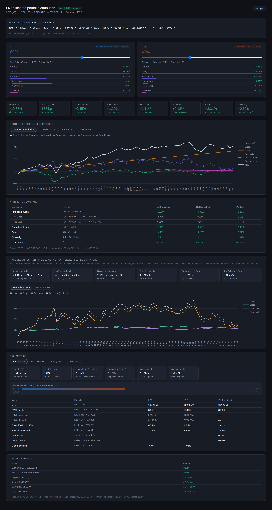

# Fixed Income Portfolio Attribution

Attribution for LQD (IG) and HYG (HY): Campisi (rate / spread / carry / convexity) on Key Rate Durations, plus a PCA split of the rate component into level / slope / curvature. Real data in, self-contained HTML out (no server).



## What it does

Weekly return for each ETF is split into:

- Rate — Treasury curve moves via KRD (LQD: 5y+30y, HYG: 2y+5y), further split into level/slope/curvature by PCA
- Spread — −Duration × ΔOAS
- Carry — coupon ÷ 52
- Convexity — the bond's own price–yield convexity (an instrument property, not curve curvature)

Weights are adjustable live. Also reports DTS, DV01, Spread VaR/CVaR with correlation and diversification benefit, rolling DTS, and drawdown.

## Yield-curve PCA

PCA on weekly changes of the 2/5/10/30 curve (covariance → eigendecomposition). The first three eigenvectors are level, slope and curvature, explaining 95%+ of curve variance. Each ETF's KRD is projected onto them:

- factor duration: β_f = KRD · v_f
- contribution: −β_f × score_f, where score_f is the curve move projected on v_f

The factors are orthogonal, so the split is additive and reconciles with the KRD rate total to ~1e-15. It refines the rate component rather than replacing anything.

The panel shows factor shapes, variance explained, per-ETF factor durations, and a weight-aware cumulative split.

## Data

| Series | Source |
|---|---|
| IG OAS (BAMLC0A0CM), HY OAS (BAMLH0A0HYM2) | FRED |
| 2y / 5y / 10y / 30y | US Treasury daily par yield curve |

Yield fallback: US Treasury → yfinance → simulation. DGS isn't used (it times out on some networks); the Treasury par curve is a no-key substitute with a real 2y and 10y.

## Run

```bash
pip install pandas numpy requests yfinance
python fetch_and_build_v7.py
```

Outputs a standalone HTML (data baked in, Plotly from CDN). Open in a browser.

## Stack

Python, Plotly.js, FRED, US Treasury, yfinance.

## Notes

Plotly loads from a CDN, so viewing needs internet. Curvature (PC3) is a small factor and its shape is noisy over short samples; a longer history settles it.
